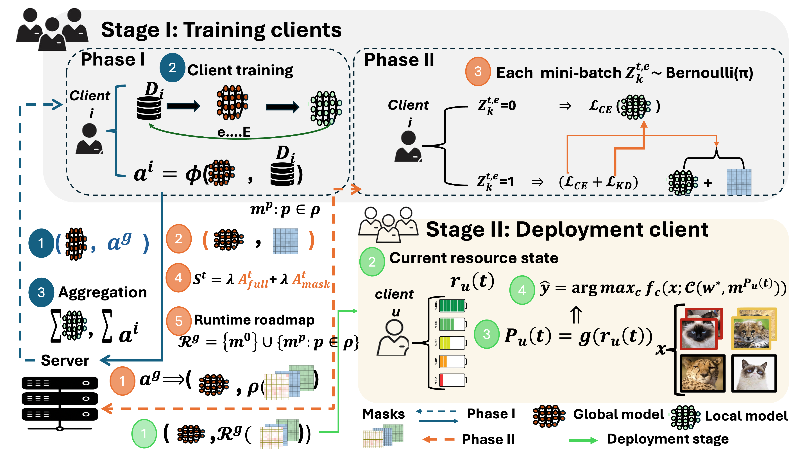

# RAS-FL: Runtime-Aware Shrinkable Federated Learning

## Abstract

This repository provides the implementation and experimental pipeline for **RAS-FL**, a runtime-aware shrinkable federated learning framework for deployment on clients with heterogeneous and time-varying resource constraints.

RAS-FL trains a shared global model while learning structured importance scores for convolutional channels and fully connected outputs. These scores are used to construct a roadmap of compact subnetworks with different computational costs. At deployment time, a client can select a suitable subnetwork according to its current resource state. The implementation also supports client-specific importance adaptation for personalized runtime configurations.

The experiments use CIFAR-10 with a VGG-style backbone and compare RAS-FL against FedAvg, FedProx, FedDrop, an OFA-style width supernet, a SLEXNet-style width and early-exit model, and Slimmable Neural Networks.



## Framework

RAS-FL separates the system into **training clients**, which participate in federated optimization, and **deployment clients**, which execute inference under time-varying resource constraints. A single trained model supports several active capacities through a family of structured masks.

### Stage I: Federated Training and Runtime Roadmap Construction

At communication round \(t\), the server broadcasts the current global model to the selected training clients. Before local optimization, each client estimates the importance of prunable structures from the same global model state. In the implementation, importance is computed from the magnitude of the weight-gradient product and accumulated for convolutional filters and fully connected outputs.

Each client then performs local training and returns:

- its locally updated model
- its structured importance estimates
- its local sample count

The server applies sample-size-weighted model averaging and updates the global importance vector using an exponential moving average. This smooths client-level variations across communication rounds.

Training begins with a full-model warm-up. After the warm-up period, each mini-batch may follow one of two paths:

- **Full-model update:** standard cross-entropy training.
- **Masked update:** a shrinkage level is sampled, low-importance structures are temporarily deactivated, and the masked model is trained with cross-entropy and optional self-distillation from the unmasked local model.

Inactive structures do not receive gradients during a masked update. This exposes one shared parameter set to several active capacities instead of training separate models.

Checkpoint selection is runtime-aware. The score combines:

- full-model validation accuracy
- average validation accuracy over selected masked configurations

After selecting the best model and importance state, the server builds a boundary-aware runtime roadmap. For each supported removal percentage, the roadmap deactivates the lowest-importance feasible structures while:

- preserving a minimum active ratio in every structured layer
- protecting the first convolutional layer more strongly
- keeping the final classifier fully active
- using a shared importance ordering across runtime levels

The output of Stage I is one selected global model together with a family of runtime-selectable structured masks.

### Stage II: Runtime Deployment and Optional Personalization

The server distributes the selected global model and runtime roadmap to deployment clients. These clients do not take part in further federated optimization, and the shared model weights remain fixed during inference.

For deployment client \(u\), the current resource state may include:

- available memory
- processor load
- battery level
- thermal condition
- latency requirement

A runtime policy maps this state to one supported shrinkage level. The client activates the corresponding mask and performs inference with the resulting submodel.

As resource availability changes, the client can move between roadmap entries and therefore shrink or expand the active model without retraining, updating the shared parameters, or downloading another checkpoint.

RAS-FL also supports optional deployment-time personalization. A client with a small local adaptation set estimates local structure importance and combines it with the global importance vector. This produces a personalized roadmap while leaving the selected global model parameters unchanged.

## Experimental Setting

### Dataset

The experiments use CIFAR-10 with standard augmentation and normalization.

Training clients are generated with a Dirichlet non-IID partition. A separate set of 20 new clients is created for deployment evaluation using stronger label skew.

### Backbone

The main backbone is a VGG-style network:

- two 64-channel convolutional layers
- two 128-channel convolutional layers
- two 256-channel convolutional layers
- three max-pooling stages
- one 512-unit hidden classifier layer
- a 10-class output layer

The Slimmable baseline uses the same full-width macro-architecture but implements width-adjustable convolution, normalization, and linear layers.

## Repository Workflow

### Cell 1: Shared Setup and Utilities

Defines:

- random seeds and device selection
- CIFAR-10 transforms and loading
- Dirichlet client partitioning
- train and validation loaders
- the VGG-style model
- shared training, aggregation, evaluation, and checkpoint helpers

### Cell 2: FedAvg

Trains the standard FedAvg baseline using weighted model averaging and validation-based early stopping.

Checkpoint:

```text
FedAvg_CIFAR10_VGG.pt
```

### Cell 3: FedProx

Trains FedProx with a proximal penalty between the local and global parameters.

Checkpoint:

```text
FedProx_CIFAR10_VGG.pt
```

### Cell 4: RAS-FL

Implements the proposed method, including:

- local structured importance estimation
- global importance aggregation
- boundary-aware structure removal
- shrinkage-aware local training
- optional self-distillation
- masked validation
- importance stabilization
- global runtime-roadmap generation

Checkpoint:

```text
RAS_FL_CIFAR10_VGG.pt
```

The checkpoint stores the model, global importance scores, runtime masks, metadata, history, and test metrics.

### Cell 5: Full-Model Evaluation

Evaluates the full-width FedAvg, FedProx, and RAS-FL models and exports a CSV summary.

### Cell 6: FedDrop

Uses random boundary-aware masks during local training and stores a fixed deployment roadmap.

Checkpoint:

```text
FedDrop_CIFAR10_VGG.pt
```

### Cell 7: OFA-Style Baseline

Trains the full model together with nested-width subnetworks.

Checkpoint:

```text
OFA_Style_CIFAR10_VGG.pt
```

### Cell 8: SLEXNet-Style Baseline

Uses nested widths and multiple classification exits. The evaluation can stop at an early exit to reduce runtime.

Checkpoint:

```text
SLEXNet_Style_CIFAR10_VGG.pt
```

### Cell 9: Slimmable Neural Networks

Implements width-adjustable layers and standard sandwich-rule training:

- largest width
- smallest width
- one randomly sampled intermediate width

Checkpoint selection uses full-width validation accuracy only. Active inference parameters and FLOPs are saved for each supported width.

Checkpoint:

```text
Slimmable_CIFAR10_VGG.pt
```

### Cell 10: New-Client and Runtime Evaluation

Evaluates all methods on 20 unseen clients and reports:

- accuracy
- loss
- macro F1
- balanced accuracy
- active structure ratio
- active parameters
- FLOPs
- inference time

For RAS-FL, both global and personalized roadmaps are evaluated. The cell also creates CSV files, serialized results, and publication-ready plots.

## Baselines

| Method | Runtime mechanism | Personalization | Importance-based |
|---|---|---:|---:|
| FedAvg | Full model | No | No |
| FedProx | Full model | No | No |
| FedDrop | Random structured masks | No | No |
| OFA-style | Nested widths | No | No |
| SLEXNet-style | Nested widths and early exits | No | No |
| Slimmable | Width-adjustable supernet | No | No |
| RAS-FL | Importance-guided runtime roadmap | Yes | Yes |

## Installation

```bash
pip install torch torchvision numpy pandas matplotlib scikit-learn
```

Update the dataset location in Cell 1:

```python
DATA_ROOT = "/path/to/cifar10"
```

The directory should contain:

```text
cifar-10-batches-py/
```

## Recommended Execution Order

```text
Cell 1
Cells 2, 3, 6, 7, 8, and 9
Cell 4
Cell 5
Cell 10
```

All checkpoint files must be available before Cell 10 is executed.

## Main Outputs

### Checkpoints

```text
FedAvg_CIFAR10_VGG.pt
FedProx_CIFAR10_VGG.pt
RAS_FL_CIFAR10_VGG.pt
FedDrop_CIFAR10_VGG.pt
OFA_Style_CIFAR10_VGG.pt
SLEXNet_Style_CIFAR10_VGG.pt
Slimmable_CIFAR10_VGG.pt
```

### Evaluation Files

```text
cifar10_vgg_full_model_baseline_results.csv
CIFAR10_VGG_20NewClients_Runtime_Results_with_Slimmable.pt
cifar10_vgg_20newclients_per_client_results_with_slimmable.csv
cifar10_vgg_20newclients_average_results_with_slimmable.csv
cifar10_vgg_runtime_table_params_flops_time_acc_with_slimmable.csv
```

### Figures

Cell 10 generates comparisons including:

- accuracy versus removed structures
- accuracy versus active structure ratio
- full-model accuracy
- per-client accuracy distributions
- parameter counts
- FLOPs
- inference time
- accuracy-efficiency trade-offs

## Reproducibility Notes

- Keep the same seed across methods.
- Use the same client partitions and loaders for all baselines.
- Use the same backbone scale and optimizer settings where applicable.
- Report active Slimmable subnetwork parameters rather than stored supernet parameters.
- Use the final SLEX exit for full-model comparisons.
- Keep the RAS-FL method name consistent in checkpoints, plots, and tables.

## Citation

Please cite the associated paper when it becomes available.

```bibtex
@article{rasfl,
  title   = {RAS-FL: Runtime-Aware Shrinkable Federated Learning},
  author  = {Author names},
  journal = {Venue},
  year    = {Year}
}
```
